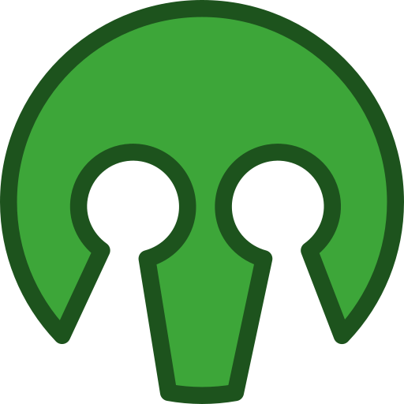

  
  <h2 align="center">OpenDating</h2>

An open-source and collaborative dating app.

## quick start
1. [Create an account](https://jl33-ai.github.io/opendating/)
2. Review the [API documentation](https://jl33-ai.github.io/opendating/)
3. Start contributing!

## contributing
This repository contains only the [matchmaking algorithm](https://github.com/jl33-ai/OpenDating/blob/main/src/algorithm.ts). The backend remains private for security.

You can help improve the algorithm by:
- Opening a [Pull Request]()
- Creating an [Issue](https://github.com/jl33-ai/OpenDating/issues/new)

See [CONTRIBUTING.md]() for local setup and [ABOUT.md]() for project details.